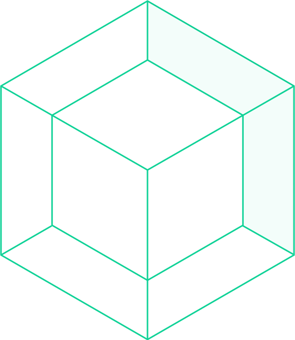

<p align="center">
  <br>
  
  <br>
  <br>
</p>

English | [简体中文](./README.zh-CN.md)

## Introduction

[](https://hub.docker.com/r/)

[](https://gulpjs.com/)

Lorem ipsum dolor sit amet consectetur, adipisicing elit. Amet, officiis nihil. Dicta quas ratione perferendis quidem distinctio, exercitationem minus assumenda modi accusamus! Earum nemo et eum dolores amet quam deleniti?

## Usage

Check out this 📑 [Documentation](https://).

## Project structure

```

```

## Changelog

## Author

## License

## Security Contact

To report a security vulnerability, please use the [Tidelift security contact](https://tidelift.com/security). Tidelift will coordinate the fix and disclosure.
